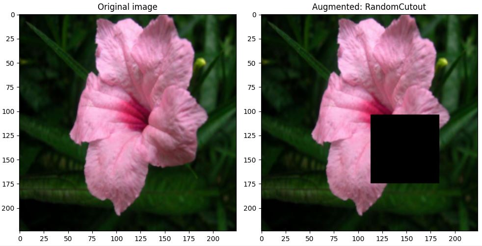
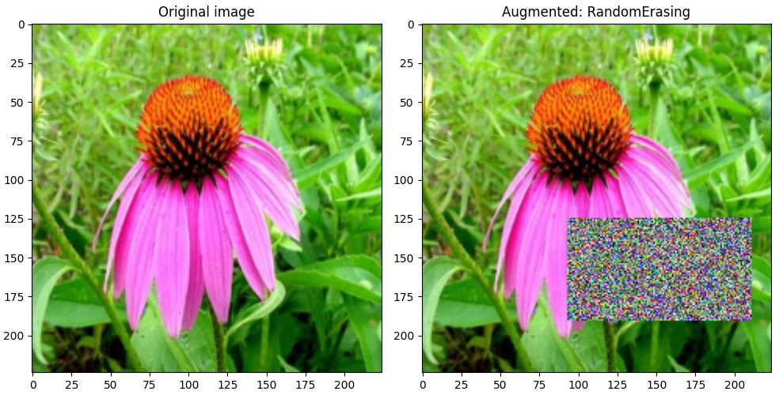
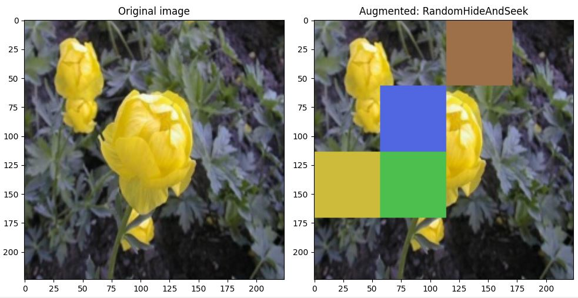
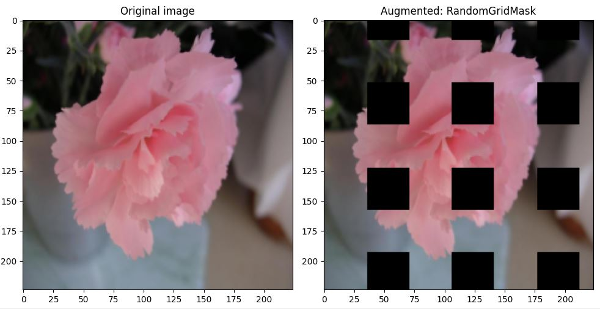
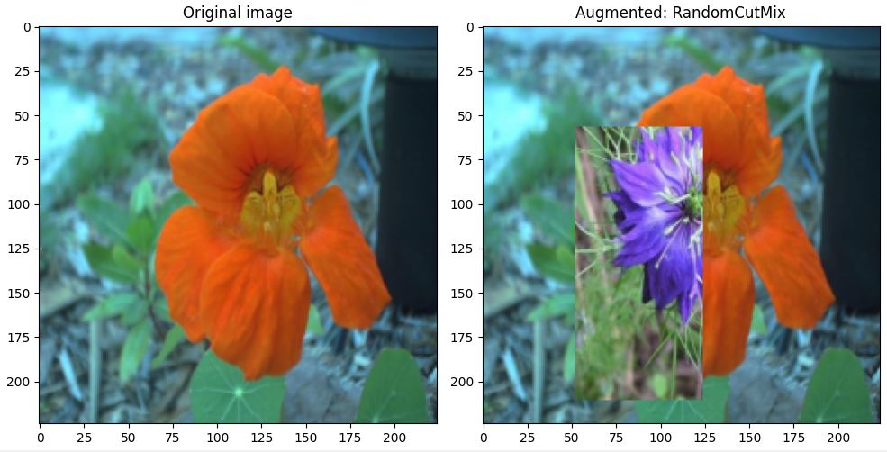
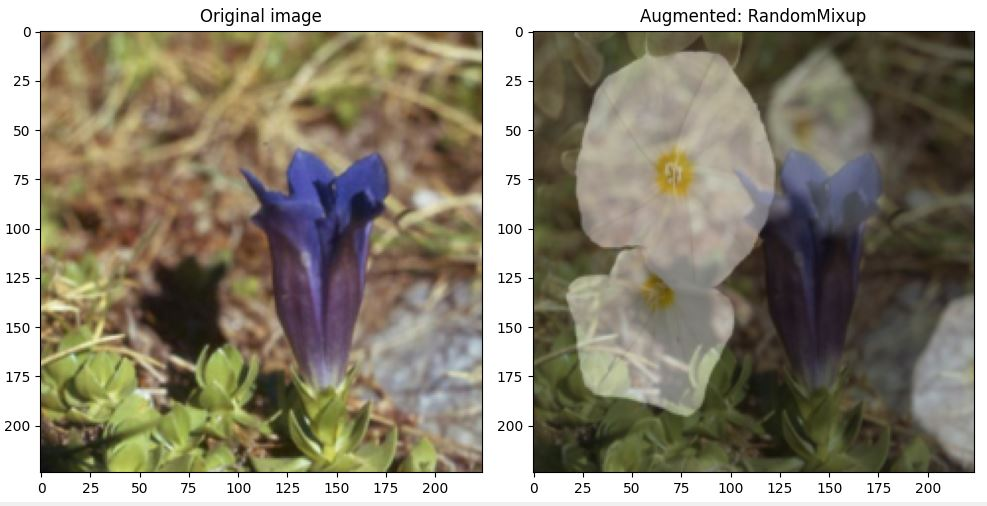
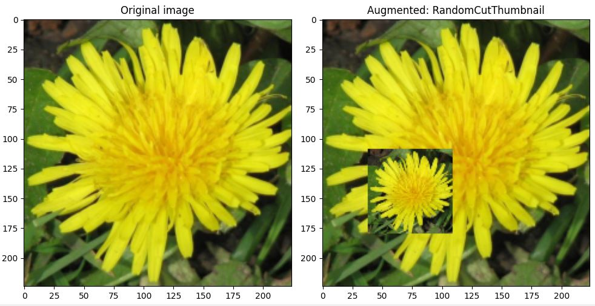
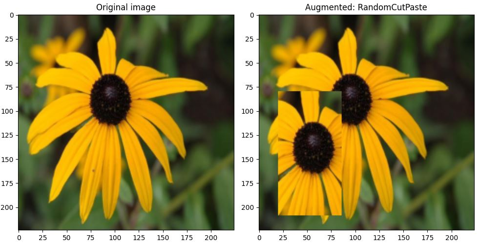
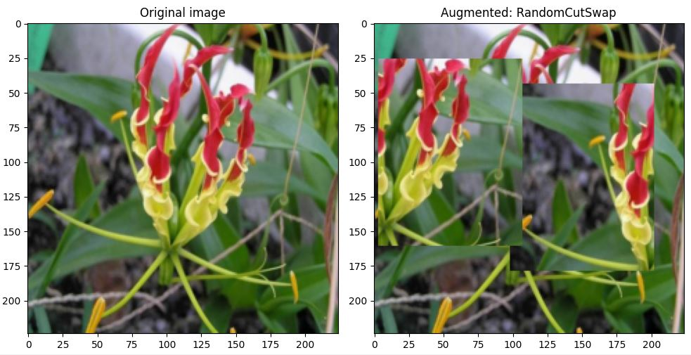

# Image Data Augmentation Using Cutting, Masking, and Mixing

Boost your model’s performance with advanced image augmentation techniques!
This repository provides high-performance, easy-to-use implementations of popular cutting, masking, and mixing strategies in both Tensorflow and Pytorch.

These methods increase dataset diversity and improve model generalization across image classification, object detection, anomaly detection, and other vision tasks.

## 1. Introduction

### Supported Augmentation Strategies

| Name            | Strategy                                                      | Application Domain                  | Research paper reference |
|-----------------|---------------------------------------------------------------|-------------------------------------|-------------|
| Cutout          | Erase a fixed-size square patch at a random location            | Image classification                      | [2] |
| Random Erasing  | Erase a rectangular patch with random size, shape, and location | Image classification, object detection, Re-Identification  | [3] |
| Hide-and-Seek   | Divide the image into a grid and randomly erase patches         | Image classification, Weakly-Supervised Localization | [4] |
| Grid Mask       | Apply a regular masking pattern                                 | Image classification, object detection    | [5] |  
| CutMix          | Cut a patch from another image and paste it into the image      | Image classification, object detection    | [6] |
| Mixup           | Blend the image with another image                              | Image classification                      | [7] |
| CutBlur         | Blur a randomly chosen region                                   | Image super-resolution                    | [8] | 
| Cut Thumbnail   | Paste a scaled-down version of the image at a random location   | Image classification (multi-scale robustness) | [9] | 
| CutPaste        | Cut a patch and paste it elsewhere in the image                 | Anomaly detection                        | [10] |  
| CutSwap         | Swap two patches of the same size within the image              | Anomaly detection                        | [11] |  

References to research papers are available at the end of this README. For an excellent survey of these techniques, see reference [1].

### Examples of images

Below are examples of augmented images, one per augmentation strategy.












### Key features

All augmentation capabilities have been designed for performance, flexibility, and ease of use.

- **Augmentation variety**: Transformations are applied independently to each image of the input batch, ensuring variety across the batch.
- **Augmentation intensity control**: A parameter is available to control the fraction of augmented images in the output batch.
- **GPU-Optimized**: Designed to be integrated directly into the training loop (not the data loading pipeline) to maximize GPU utilization.
- **Image support**: Both RGB and grayscale images are supported.
- **Default values**: Default settings are provided, allowing for immediate use without extensive setup.
- **Parameter validation**: Augmentation parameters are thoroughly verified and detailed error messages are provided.

## 2. Tensorflow implementation

### Layers and functions

Most augmentation capabilities are implemented as custom layers. These layers can be used in the preprocessing stack and mixed freely with Tensorflow layers, such as RandomContrast and RandomFlip.

There are two augmentation strategies that require a different approach: CutMix and Mixup. Unlike the other augmentation techniques that alter a single image and leave the labels unchanged, CutMix and Mixup combine two images and modify the labels to reflect the contribution of both. This cannot be handled with layers as they operate only on images. For these capabilities, functions are provided that can be used in a custom model.

Both layers and functions were designed to be integrated in the training loop to maximize GPU utilization (they are vectorized and compilable into Tensorflow's graph). Training script examples are provided that demonstrate the use of preprocessing layers and custom models. The purpose of these scripts is to show how to use the available capabilities, not to actually train a model. All the layers and functions are used successively, which would not make sense in an actual training.

Each layer and function comes with a detailed docstring in the source code that describes its parameters.

### Source Code

The Tensorflow source code is in directory **src/tf**

| Strategy        | File               |  Name                | Implementation  |
|-----------------|--------------------|----------------------|-----------------|
| Cutout          | `cutout.py`        | `RandomCutout`       |    Layer        |
| Random Erasing  | `erasing.py`       | `RandomErasing`      |    Layer        |
| Hide-and-Seek   | `hide_and_seek.py` | `RandomHideAndSeek`  |    Layer        |
| Grid Mask       | `grid_mask.py`     | `RandomGridMask`     |    Layer        |
| CutMix          | `cutmix.py`        | `random_cutmix`      |    Function     |
| Mixup           | `mixup.py`         | `random_mixup`       |    Function     |
| CutBlur         | `cutblur.py`       | `RandomCutBlur`      |    Layer        |
| Cut Thumbnail   | `cut_thumbnail.py` | `RandomCutThumbnail` |    Layer        |
| CutPaste        | `cutpaste.py`      | `RandomCutPaste`     |    Layer        |
| CutSwap         | `cutswap.py`       | `RandomCutSwap`      |    Layer        |


The directory also contains the files listed in the table below.

| File                   | Contains                                   | 
|------------------------|--------------------------------------------|
| test_images.py         | Script to view augmented images            | 
| argument_utils.py      | Parameter checking utilities               | 
| dataaug_utils.py       | Shared functions                           | 
| train_preproc_layer.py | Training script using preprocessing layers | 
| train_custom_model.py  | Training script using a custom model       | 


### Running scripts

The image viewing and training scripts can be run as follows:

```bash
cd src/tf

# Run the image viewing script
python test_images.py

# Run the training script that uses preprocessing layers
python train_preproc_layer.py

# Run the training script that uses a custom model
python train_custom_model.py
```


### Making results reproducible

Random generation is used extensively in all layers and functions.

To make your results reproducible, set global seeds as shown below.

```bash
import random
import numpy as np
import Tensorflow as tf

seed = 1234
random.seed(seed)             # Python RGN
np.random.seed(seed)          # NumPy RGN
tf.random.set_seed(seed)      # Tensorflow RGN
```

Seeds should be set immediately after importing Python packages and Tensorflow, before you import the data augmentation packages (and any other packages you may have).

## 3. Pytorch Implementation

### V2 transforms

All augmentation capabilities are implemented as V2 transforms. They can be mixed freely with Pytorch V2 transforms, such as color jitter and affine transforms. As they are integrated in the training loop, they run on the GPU.

Note that only V2 transforms run on the GPU, not the transforms that were initially in Pytorch (and still are). These transforms are integrated in the data loading pipeline, and thus run on the CPU.

An example of training script is provided that demonstrates the use of the data augmentation transforms. The purpose of this script is to show how to use the available capabilities, not to actually train a model. All the transforms are used successively, which would not make sense in an actual training.

Each transform comes with a detailed docstring in the source code that describes its parameters.


### Source Code

The Pytorch source code is in directory **src/pt**

| Method          | File               |  transform.v2        |
|-----------------|--------------------|----------------------|
| Cutout          | `cutout.py`        | `RandomCutout`       |
| Random Erasing  | `erasing.py`       | `RandomErasing`      |
| Hide-and-Seek   | `hide_and_seek.py` | `RandomHideAndSeek`  |
| Grid Mask       | `grid_mask.py`     | `RandomGridMask`     |
| CutMix          | `cutmix.py`        | `random_cutmix`      |
| Mixup           | `mixup.py`         | `random_mixup`       |
| CutBlur         | `cutblur.py`       | `RandomCutBlur`      |
| Cut Thumbnail   | `cut_thumbnail.py` | `RandomCutThumbnail` |
| CutPaste        | `cutpaste.py`      | `RandomCutPaste`     |
| CutSwap         | `cutswap.py`       | `RandomCutSwap`      |

The directory also contains the files listed in the table below.

| File                   | Contains                         |
|------------------------|----------------------------------|
| test_images.py         | Script to view augmented images  | 
| argument_utils.py      | Parameter checking utilities     | 
| dataaug_utils.py       | Shared functions                 | 
| train.py               | Training script                  | 


### Running scripts

The image viewing and training script can be run as follows:

```bash
cd src/pt

# Run the image viewing script
python test_images.py

# Run the training script
python train.py
```

### Making results reproducible

Random generation is used extensively in all transforms.

To make results reproducible, set global seeds as shown below.

```bash
import random
import numpy as np
import torch

seed = 1234
random.seed(seed)                 # Python RNG
np.random.seed(seed)              # NumPy RNG
torch.manual_seed(seed)           # CPU RNG
torch.cuda.manual_seed(seed)      # current GPU RNG
torch.cuda.manual_seed_all(seed)  # all GPU devices
```

Seeds should be set immediately after importing Python packages and Pytorch, before you import the data augmentation packages (and any other packages you may have).


## 4. Visualizing augmented images

The **src/tf** and **src/pt** directories both contain a script named `test_images.py`.

These scripts enable you to test the different augmentation capabilities on the Flowers dataset (5 classes for Tensorflow, 102 classes for Pytorch). Original images and augmented images are displayed side-by-side. The images above were created with these scripts.

Using these image viewing scripts, you can play with the parameters of the layers, functions and transforms, and visualize the effects.

In the **main()** function of the scripts, you can customize:

- Image size
- RGB or grayscale images
- List of augmentation features to test
- Number of augmented images per function
- Seed for dataset shuffling

If you set the shuffling seed to `None`, you will get a different sequence of images every time you run the script. If you set it to an integer value, you will always get the same sequence.


## 5. Research paper references

[1] Teerath Kumar, Alessandra Mileo, Rob Brennan, Malika Bendechache (2023). **Image Data Augmentation Approaches: A Comprehensive Survey and Future directions**.

[2] Terrance DeVries, Graham W Taylor (2020). **Improved regularization of convolutional neural networks with cutout**.

[3] Zhun Zhong , Liang Zheng, Guoliang Kang, Shaozi Li , Yi Yang (2017). **Random erasing data augmentation**.

[4] Krishna Kumar Singh, Hao Yu, Aron Sarmasi, Gautam Pradeep, Yong Jae Lee (2018). **Hide-and-seek: A data augmentation technique for weakly-supervised localization and beyond**.

[5] Pengguang Chen, Shu Liu, Hengshuang Zhao, Jiaya Jia (2020). **GridMask data augmentation**.

[6] Sangdoo Yun, Dongyoon Han, Seong Joon Oh, Sanghyuk Chun, Junsuk Choe, Youngjoon Yoo (2019): **CutMix: Regularization Strategy to Train Strong Classifiers with Localizable Features**.

[7] Hongyi Zhang, Moustapha Cisse, Yann N. Dauphin, David Lopez-Paz (2017). **Mixup: Beyond Empirical Risk Minimization**.

[8] Jaejun Yoo, Namhyuk Ahn, Kyung-Ah Sohn (2020). **Rethinking data augmentation for image super-resolution: A comprehensive analysis and a new strategy**.

[9] Tianshu Xie, Xuan Cheng, Xiaomin Wang, Minghui Liu, Jiali Deng, Tao Zhou, Ming Liu (2021). **Cut-thumbnail: A novel data augmentation for convolutional neural network**.

[10] Chun-Liang Li, Kihyuk Sohn, Jinsung Yoon, Tomas Pfister (2021). **CutPaste: Self-Supervised Learning for Anomaly Detection and Localization**.

[11] Jianjian Qin, Chunzhi Gu, Jun Yu, Chao Zhang (2023). **Multilevel Saliency-Guided Self-Supervised Learning for Image Anomaly Detection**.
