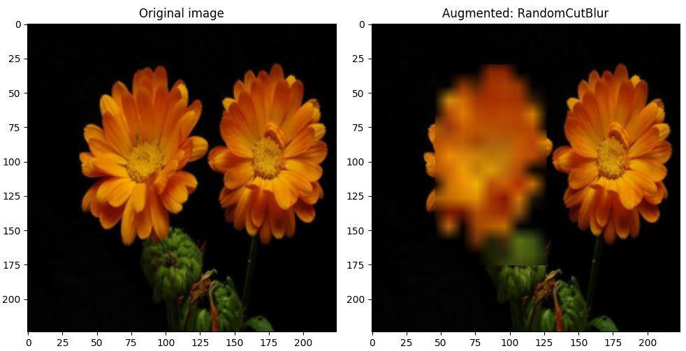

# Image Data Augmentation With Tensorflow

Boost your model’s performance with advanced image augmentation techniques! This repository provides a collection of TensorFlow functions and layers that modify images using cutting, masking, and mixing strategies. These methods help increase dataset diversity and improve generalization.

## Supported Augmentation Strategies

- **Cutout** – Erase a fixed-size square patch at a random location [2].
- **Random Erasing** – Erase a rectangular patch with random size, shape, and position [3].
- **Hide-and-Seek** – Divide the image into a grid and randomly erase patches [4].
- **Grid Mask** – Apply a regular masking pattern [5].
- **CutBlur** – Blur a randomly chosen region [6].
- **CutPaste** – Cut a patch and paste it elsewhere in the image [7].
- **CutSwap** – Swap two patches of the same size within the image [8].
- **Cut Thumbnail** – Paste a scaled-down version of the image at a random location [9].
- **CutMix** – Replace a patch with one from another image [10].
- **Mixup** – Blend the image with another image [11].

References to research papers are available at the end of this README. For an excellent survey of these techniques, see reference [1].

## Key features

This library is designed for performance and flexibility, with features including:

- **Argument validation**: The arguments passed to the functions are thoroughly verified and detailed error messages are provided.
- **Image support**: Both RGB and grayscale images are supported.
- **Default values**: Functions come with reasonable default values, allowing for immediate use without extensive setup.
- **GPU utilization**: All functions take a batch of images as input. They are fully vectorized and compilable into Tensorflow's graph, maximizing GPU utilization.
- **Augmentation variety**: Transformations are applied independently to each image of the input batch, ensuring variety across the batch.
- **Augmentation intensity control**: A parameter is available to control the fraction of augmented images in the output batch.
- **Integration in training loops**: Functions are easy to integrate in the training loop, using either preprocessing layers or custom models.

## Examples of augmented images





## Source Code

The source code is organized as shown in the table below.


| Method          | File               | Function                 | Keras layer            |
|-----------------|--------------------|--------------------------|------------------------|
| Cutout          | `cutout.py`        | `random_cutout`          | `RandomCutout`         |
| Random Erasing  | `erasing.py`       | `random_erasing`         | `RandomErasing`        |
| Hide-and-Seek   | `hide_and_seek.py` | `random_hide_and_seek`   | `RandomHideAndSeek`    |
| Grid Mask       | `grid_mask.py`     | `random_grid_mask`       | `RandomGridMask`       |
| CutBlur         | `cutblur.py`       | `random_cutblur`         | `RandomCutblur`        |
| CutPaste        | `cutpaste.py`      | `random_cutpaste`        | `RandomCutPaste`       |
| CutSwap         | `cutswap.py`       | `random_cutswap`         | `RandomSwap`           |
| Cut Thumbnail   | `cut_thumbnail.py` | `random_cut_thumbnail`   | `RandomCutThumbnail`   |
| CutMix          | `cutmix.py`        | `random_cutmix`          |  N/A                   |
| Mixup           | `mixup.py`         | `random_mixup`           |  N/A                   |

The following files are also part of the source code:

| File                     | Contents                                                    
|--------------------------|------------------------------------------------------------------|
| `dataaug_utils.py`       | Utilities shared by the data augmentation functions and layers   |
| `test.py`                | Runs a set of data augmentation functions and displays original/augmented images side-by-side |
| `train_preproc_layer.py` | Training script example using a preprocessing layer              |
| `train_custom_model.py`  | Training script example using a custom model                     |

## Running a test

To test the available data augmentation functions on the Flowers dataset, change the current directory to *src* and run the following script:

```bash
python test.py
```

In the **\_\_main\_\_** part of the script, you can customize:

- Image size
- RGB or grayscale images
- List of augmentation functions to test
- Number of augmented images per function
- Seed for dataset shuffling

Using this script, you can play with the parameters of the functions and visualize the effects.

If you set the shuffling seed to None, you will get a different sequence of images every time you run the script. If you set it to an integer value, you will always get the same sequence.

You can also replace the *_get_data_loader()* function with your own to test the data augmentation functions on a different dataset than Flowers.

## Function arguments

Each function comes with a detailed docstring in the source code.

## Results reproducibility

Random generation is used extensively in all functions.

To make your results reproducible, set a global Tensorflow seed:

```bash
import tensorflow as tf
tf.random.set_seed(123)
```

## Integration in the training loop

Two methods can be used to integrate the data augmentation functions in the training loop:

1. **Custom layer**: Wraps the function in a custom layer that can be used as a preprocessing layer. This layer can be freely combined with TensorFlow’s built-in preprocessing layers, such as RandomContrast and RandomRotation.

2. **Custom model**: Calls the function inside the model’s *train_step()* method. TensorFlow’s built-in layers can also be used within this method.

Preprocessing layers are provided for all functions except CutMix and Mixup. These two methods combine two images and update the labels to reflect the contribution of both, which cannot be done with preprocessing layers as they operate only on images. For these functions, a custom model implementation is required.

Two example training scripts are included: one demonstrating the preprocessing layer approach and another using a custom model.

## Research paper references

[1] Teerath Kumar, Alessandra Mileo, Rob Brennan, Malika Bendechache (2023). **Image Data Augmentation Approaches: A Comprehensive Survey and Future directions**.

[2] Terrance DeVries, Graham W Taylor (2020). **Improved regularization of convolutional neural networks with cutout**.

[3] Zhun Zhong , Liang Zheng, Guoliang Kang, Shaozi Li , Yi Yang (2017). **Random erasing data augmentation**.

[4] Krishna Kumar Singh, Hao Yu, Aron Sarmasi, Gautam Pradeep, Yong Jae Lee (2018). **Hide-and-seek: A data augmentation technique for weakly-supervised localization and beyond**.

[5] Pengguang Chen, Shu Liu, Hengshuang Zhao, Jiaya Jia (2020). **GridMask data augmentation**.

[6] Jaejun Yoo, Namhyuk Ahn, Kyung-Ah Sohn (2020). **Rethinking data augmentation for image super-resolution: A comprehensive analysis and a new strategy**.

[7] Chun-Liang Li, Kihyuk Sohn, Jinsung Yoon, Tomas Pfister (2021). **CutPaste: Self-Supervised Learning for Anomaly Detection and Localization**.

[8] Jianjian Qin, Chunzhi Gu, Jun Yu, Chao Zhang (2023). **Multilevel Saliency-Guided Self-Supervised Learning for Image Anomaly Detection**.

[9] Tianshu Xie, Xuan Cheng, Xiaomin Wang, Minghui Liu, Jiali Deng, Tao Zhou, Ming Liu (2021). **Cut-thumbnail: A novel data augmentation for convolutional neural network**.

[10] Sangdoo Yun, Dongyoon Han, Seong Joon Oh, Sanghyuk Chun, Junsuk Choe, Youngjoon Yoo (2019): **CutMix: Regularization Strategy to Train Strong Classifiers with Localizable Features**.

[10] Hongyi Zhang, Moustapha Cisse, Yann N. Dauphin, David Lopez-Paz (2017). **Mixup: Beyond Empirical Risk Minimization**.


